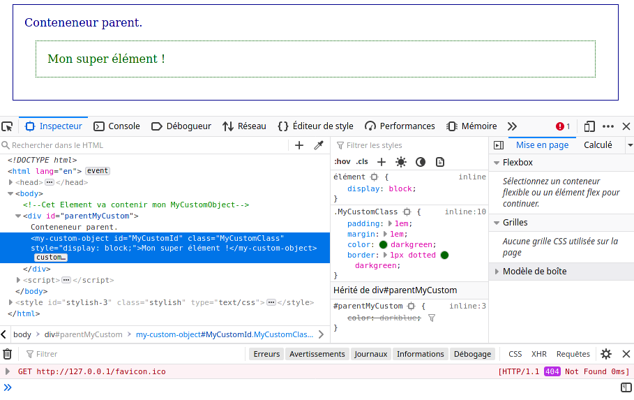

# CustomElement

Vous rêviez de créer votre propre balise HTML ? 
Avec JavaScript, c'est possible ! 



## Pourquoi faire ? 

* Permet d'organiser le code ; 
  * Programmation Orienté Objet. 
  * Programmation modulaire.
* Permet de personaliser un objet au comportement complexe :
  * Sans surcharger le code (eventlistener, etc.).
  * Tout en respectant les standards w3c.

## Comment faire ? 

### La POO, c'est Class ! 

D'abord : créez un objet qui étands l'interface HTMLElement (ou un autre élément).

```js

    /**
     * Définir une classe qui représente l'objet que vous voulez créer. 
     * Étendez la avec l'interface HTMLElement.
     * Puis contruisez la comme un objet classqiue. 
     */
    class MyCustomObject extends HTMLElement
    {
        constructor(content = null, id = null, classes = null)
        {
            // Avant toutes choses !
            // Appeler le constructeur parent.
            super();
            
            // Attribuer ID et Classes.
            this.id = id ?? null;
            if (classes != null) this.classList.add(classes); 

            // Appliquez du style si besoin.
            this.style.display = 'block';

            // Définir le contenu.
            this.innerHTML = content;
        }   

        /**
         *  Si besoin : ajoutez des méthodes décrivant le comportement de votre objet. 
         */
    }

```

Dites à JS que vous avez crée un tag. 

```js

    /**
     * Faire reconnaitre l'objet par JavaScript.
     * Sinon pas contant ! 
     */
    customElements.define('my-custom-object', MyCustomObject);
```

Créez l'élément et placez le dans son parent. 

```js
    // Instancier l'objet depuis la classe ! 
    let MyCustomELement = new MyCustomObject('Mon super élément !', 'MyCustomId', 'MyCustomClass');
    
    // Prendre le parent qui va recevoir notre objet.
    let target = document.getElementById('parentMyCustom');
    
    // Injecter dans le parent. 
    target.appendChild(MyCustomELement);

```

Et voilà ! Normalement, l'objet a été placé sur la page !

Sinon, c'est que vous vous êtes planté quelque part... 


### [ `optionnel` ] **Faire hériter**

Au moment de déclarer l'objet à JS : ajoutez que vous ouvrez l'héritage vars le tag qui vous intéresse. 

```js
    customElements.define('my-custom-object', MyCustomObject, { extends: 'div' });
```

Et mon div hérite de ma class avec l'attribut `is`. 
```html
    <div is="my-custom-object"> </div>
```

## source
* [CustomElementRegistry | MDN](https://developer.mozilla.org/en-US/docs/Web/API/CustomElementRegistry/define)